# Task： 捕捉信息转化为一个IDEA，一个TODO ITEM

## 描述

实现一个飞书 Bot，用于实时捕捉terminal输入的信息和飞书中的信息，并将其转化为为一个 TODO的MAKRDOWN文件和多维表格中的一个任务ITEM。
大体架构如下图所示：

实现内容如下：
1. 这个任务只做Terminal 收集idea，和飞书中收集IDEA，保存为MARKDOWN文件和飞书多维表格的一个TODO ITEM
2. 集成飞书的feishu-cli，可以参考的github repo如下:
    - https://github.com/riba2534/feishu-cli
    - https://github.com/larksuite/cli
3. 可以先clone这两个repo作为submodule方便参考
4. 基本机构和feishu-cli使用的golang一样，但是需要支持tui界面
5. 支持这些idea的list，create，update，delete操作
6. 创建和更新AGENTS.md/README.md文件
7. 根据整个项目内容了解上下文，然后开始进行mindstorm，确定功能点和实现路径，进行计划确定实现拆解任务，生成一份还算比较好的PRD文件，最有有流程图
8. 完整整个功能时候更新usage目录中内容，增加这个idea捕捉的使用文档
9. 给出如何配置飞书配置，同步的使用说明

## 验收标准

- [ ] 验证这些idea的list，create，update，delete操作，markdown文件和飞书多维表格是否同步
- [ ] 添加对应的单元测试
- [ ] 更新 README 使用说明
- []  创建和更新AGENTS.md文件
